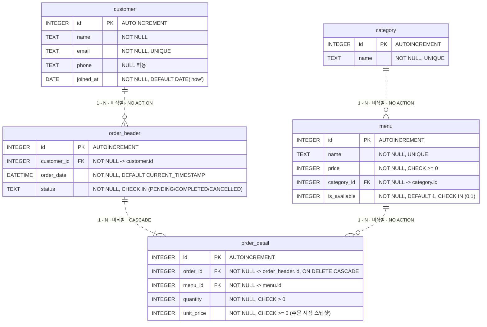

# SQL로 만드는 나만의 데이터베이스 — 카페 주문 시스템

코디세이 B5-1 미션 산출물. 백엔드 프레임워크 없이 **SQL만으로** 도메인을 모델링하고, 샘플 데이터를 넣고, 요구사항을 쿼리로 해결하는 흐름 전체를 담았다.

- **DBMS**: SQLite 3 (검증 환경: SQLite 3.39.4 / Python 3.10.10 / Windows)
  → 실제 검증 버전은 `results/*.txt` 첫 8줄의 메타데이터 블록에 자동 기록된다.
- **주제**: 카페 주문 관리
- **테이블 수**: 5개 (요구 4개 이상 충족)
- **1:N 관계**: 4개 (요구 2개 이상 충족)
- **쿼리**: 핵심 15개 + 대조/보강 7개

---

## 1. 디렉터리 구성

```
codyssey_B5-1/
├── 01_schema.sql          # 스키마 생성 (CREATE TABLE, PK/FK/제약조건)
├── 02_data.sql            # 샘플 데이터 INSERT (각 테이블 ≥ 10행)
├── 03_queries.sql         # 핵심 쿼리 15개 + 대조/보강 7개
├── 04_bonus.sql           # 보너스 과제 3종
├── build_and_capture.py   # DB 빌드 + 결과 캡처 (단일 진입점)
├── results/
│   ├── results.txt        # 03_queries.sql 실행 결과
│   └── bonus_results.txt  # 04_bonus.sql 실행 결과 (제약 위반 에러 포함)
├── cafe.db                # (재생성 가능) SQLite 데이터 파일
└── README.md
```

> **`cafe.db` 의 상태**: 커밋된 `cafe.db` 는 `build_and_capture.py` 를 끝까지 실행한 **최종 상태**다.
> 즉 `03_queries.sql` 의 Q13/Q14/Q15 가 이미 적용되어 있다 —
> 아메리카노 `4000`원 / `order_header` 10행(CANCELLED 2건 삭제됨) / `order_detail` 18행 / 직접 만든 인덱스 2개.
> `results/results.txt` 의 마지막 부분과 정확히 일치한다.

---

## 2. 실행 방법

```bash
python build_and_capture.py
```

이 한 줄이 다음을 순서대로 수행한다.

1. `cafe.db` 를 지우고 `01_schema.sql` + `02_data.sql` 로 새로 만든다
2. `04_bonus.sql` → `results/bonus_results.txt`
3. `03_queries.sql` → `results/results.txt`

### ★ 실행 순서가 중요한 이유

`03_queries.sql` 의 **Q13(UPDATE)과 Q14(DELETE)는 DB 상태를 실제로 바꾼다.**
특히 Q14 는 `status='CANCELLED'` 주문을 지우는데, **박지호의 유일한 주문이 취소건**이라
이걸 먼저 실행해 버리면 보너스 (1)의 결과가 4행에서 3행으로 줄어든다.

| 실행 순서 | `[BONUS 1-a]` 결과 |
| --- | --- |
| 보너스 → 쿼리 **(올바름)** | 김민준, 이서연, **박지호**, 정우진 → **4행** |
| 쿼리 → 보너스 (틀림) | 김민준, 이서연, 정우진 → 3행 |

그래서 `build_and_capture.py` 는 항상 **보너스를 먼저** 캡처한다.
`04_bonus.sql` 첫 쿼리는 이 전제를 스스로 검증하는 자가진단이다
(`orders_expect_12` / `cancelled_expect_2` / `details_expect_20` / `americano_expect_3500`).

### sqlite3 CLI 로 직접 실행하기

CLI 가 설치되어 있다면 아래로도 동일한 결과를 얻는다. (순서는 위와 같아야 한다)

```bash
rm -f cafe.db
sqlite3 cafe.db < 01_schema.sql
sqlite3 cafe.db < 02_data.sql
sqlite3 -box -header cafe.db < 04_bonus.sql   > results/bonus_results.txt   # 먼저
sqlite3 -box -header cafe.db < 03_queries.sql > results/results.txt         # 나중
```

`04_bonus.sql` 은 일부러 실패하는 문장을 포함하므로 **종료코드 1 이 정상**이다.

> **주의**: SQLite 는 외래 키 강제 적용이 **연결마다 기본 OFF** 다. 모든 스크립트는 첫 줄에서
> `PRAGMA foreign_keys = ON;` 을 켠다. GUI 도구(DBeaver, DataGrip 등)에서 새 연결로 열면
> 직접 한 번 실행해 줘야 FK 가 동작한다. (자세한 내용은 7.1)

---

## 3. 데이터 모델



> **선을 읽는 법.** ERD 표기법에서 실선은 식별 관계, 점선은 비식별 관계다. 위 그림의 네 선이 모두 점선인 것은
> 표기 누락이 아니라 **대리키 설계의 결과**다 — 5개 테이블 전부 단일 `id` 를 PK 로 써서 부모 PK 가 자식 PK 에
> 포함되는 곳이 한 군데도 없다(3.3 참고). 그래서 이 그림에서 실제로 갈리는 축은 식별 여부가 아니라 **삭제 정책**이고,
> 그걸 관계 라벨에 적었다. 끝단 기호도 데이터와 맞췄다 — 주문은 상세가 반드시 1줄 이상이라 `|{`, 나머지 셋은
> 메뉴 0개인 카테고리('굿즈') · 주문 0건인 고객('서지안') · 한 번도 안 팔린 메뉴('에그샌드위치')가 실제로 있어 `o{` 다.

### 3.1 왜 테이블을 이렇게 나눴나

엑셀이었다면 "주문번호 / 고객명 / 전화번호 / 메뉴명 / 카테고리 / 단가 / 수량" 을 **한 시트에 반복 입력**했을 것이다.
그때 생기는 문제를 각각 어떤 테이블 분리로 해결했는지가 이 설계의 전부다.

| 분리한 테이블 | 한 시트로 뭉쳤을 때의 문제 | 분리해서 얻은 것 |
| --- | --- | --- |
| `customer` | 고객이 전화번호를 바꾸면 그 고객의 **모든 주문 행**을 찾아 고쳐야 한다 | 고객 정보는 한 곳에만 있다 (수정 이상 제거) |
| `category` | '커피' / '커 피' 처럼 오타가 섞여 집계가 갈라진다 | FK 로 오타 자체가 불가능해진다 |
| `menu` | 메뉴 가격을 바꾸려면 주문 행을 전부 훑어야 한다 | 메뉴는 한 행, 가격 변경은 한 번 |
| `order_header` / `order_detail` | 주문 1건에 메뉴가 3개면 고객·주문일시가 3번 중복된다 | 반복되는 부분(헤더)과 반복 안 되는 부분(라인)을 분리 |

**`order_header` / `order_detail` 를 나눈 것이 이 도메인의 핵심**이다.
"주문 1건"과 "주문에 담긴 메뉴 1줄"은 개수가 다르기 때문에 한 테이블로 만들 수 없다.
주문 12건에 상세 20줄 — 이 1:N 이 바로 장바구니 구조다.

### 3.2 왜 이 컬럼 타입인가

| 컬럼 | 타입 | 선택 이유 |
| --- | --- | --- |
| 모든 `id` | `INTEGER PRIMARY KEY AUTOINCREMENT` | SQLite 에서 `INTEGER PRIMARY KEY` 는 `rowid` 의 별칭이라 그 자체로 자동 증가한다. `AUTOINCREMENT` 를 덧붙이면 **삭제된 id 를 재사용하지 않는** 보장이 추가된다. 주문/결제는 과거 식별자가 재사용되면 안 되는 도메인이라 명시했다. 대신 `sqlite_sequence` 유지 비용이 붙는다. |
| `name`, `email` | `TEXT` | 길이가 가변이고 산술 연산 대상이 아니다. |
| `phone` | `TEXT` (**not** INTEGER) | `010-1234-5678` 은 하이픈과 **선행 0** 이 의미를 갖는다. INTEGER 로 저장하면 앞의 0 이 사라지고 하이픈도 못 넣는다. "숫자처럼 생겼지만 계산하지 않는 값은 문자열" 이 원칙. |
| `price`, `unit_price` | `INTEGER` (**not** REAL) | 원(KRW)은 소수점이 없다. 금액에 부동소수(REAL)를 쓰면 합계에 오차가 누적된다. |
| `quantity` | `INTEGER` | 개수는 정수. `CHECK (quantity > 0)` 으로 0/음수 차단. |
| `is_available` | `INTEGER` 0/1 | SQLite 에는 `BOOLEAN` 타입이 없다. `CHECK (is_available IN (0,1))` 로 다른 값을 막았다. |
| `joined_at` | `DATE` | **SQLite 에는 `DATE` 타입이 실제로 없다.** NUMERIC 어피니티 힌트일 뿐이고 값은 `TEXT` 로 저장된다 (`SELECT typeof(joined_at)` → `text`). 그래도 `YYYY-MM-DD` 포맷을 쓰면 **사전순 정렬 = 날짜순 정렬**이라 Q3 의 `ORDER BY joined_at DESC` 가 그대로 동작한다. |
| `order_date` | `DATETIME` | 위와 동일하게 어피니티 힌트. `YYYY-MM-DD HH:MM:SS` TEXT 로 저장된다. `DEFAULT CURRENT_TIMESTAMP` 는 **UTC** 기준이라 실서비스라면 시간대 보정이 필요하다. |

### 3.3 설계 포인트

- **`order_detail.unit_price` 는 주문 시점 가격의 스냅샷**이다. `menu.price` 를 조인해서 쓰지 않는 이유는, 가격이 바뀌면 과거 매출까지 소급 변경되기 때문이다.
  실증: Q13 에서 아메리카노를 3500 → 4000 으로 올려도 과거 주문 합계는 3500 기준으로 유지된다.
- **`ON DELETE CASCADE` 는 `order_detail.order_id` 하나에만** 걸었다. 주문 헤더가 사라지면 그 상세 라인은 존재 의미가 없기 때문(주문 없는 주문상세 = 고아 데이터). 반대로 고객·카테고리·메뉴는 이력 보존이 우선이라 정책 없음(NO ACTION)으로 두어 **삭제가 막히도록** 했다.

  | 삭제 시도 | 결과 |
  | --- | --- |
  | `DELETE FROM customer WHERE id=1` | `FOREIGN KEY constraint failed` (차단) |
  | `DELETE FROM category WHERE id=1` | `FOREIGN KEY constraint failed` (차단) |
  | `DELETE FROM order_header WHERE id=1` | 성공. `order_detail` 20행 → 18행 (CASCADE) |

  > 이 구분에는 이름이 있다. `order_header` → `order_detail` 처럼 **부모 없이는 자식이 존재할 수 없는** 관계를 **식별 관계(identifying)**, 나머지 3개처럼 부모가 사라져도 자식이 자기 신원을 따로 갖는 관계를 **비식별 관계(non-identifying)** 라 부른다.
  > 다만 엄밀한 ERD 표기법은 "부모 PK 가 자식 PK 에 포함되는가" 로 가른다. 이 스키마는 5개 테이블 전부 단일 대리키 `id` 를 PK 로 써서, 그 기준으로는 4개 관계 모두 비식별이다.
  > `order_detail` 을 진짜 식별 관계로 만들려면 PK 를 `(order_id, line_no)` 복합키로 잡아야 한다 — 이번엔 조인 규칙을 `부모.id = 자식.부모_id` 하나로 통일하려고 대리키를 택했다.

- **`(order_id, menu_id)` 복합 UNIQUE 는 일부러 걸지 않았다.** 같은 주문에 옵션이 다른 같은 메뉴(ICE/HOT)가 별도 라인으로 들어갈 수 있어야 하기 때문이다. 대신 집계는 전부 `SUM(quantity)` 기준이라 라인이 나뉘어도 수치는 정확하다.

---

## 4. 핵심 쿼리 15개 (+ 대조/보강 7개)

| # | 범주 | 설명 |
| --- | --- | --- |
| Q1 | 기본 조회 | 판매중인 메뉴를 가격 내림차순으로 조회 |
| Q2 | 기본 조회 | 5,000원 이상 메뉴 (품절 포함 — 목적이 '가격대 분석'이라 기준이 Q1과 다름) |
| Q3 | 기본 조회 | 최근 가입 고객 TOP 5 (`ORDER BY … LIMIT`) |
| Q4 | 기본 조회 | 'COMPLETED' 주문 최신 10건 (`WHERE` + `ORDER BY` + `LIMIT`) |
| **Q4-B** | 기본 조회(검색) | 메뉴명 부분일치 검색 (`LIKE '%라떼%'`) |
| Q5 | INNER JOIN | 메뉴 + 카테고리명 |
| Q6 | INNER JOIN (4테이블) | 주문 상세 + 고객명 + 메뉴명 + 라인 합계 |
| Q7 | LEFT JOIN | 주문 0건 고객까지 포함한 고객별 주문 수 |
| **Q7-B** | 대조 | `COUNT(*)` vs `COUNT(컬럼)` 을 나란히 놓고 차이 확인 |
| Q8 | INNER JOIN + 집계 | 카테고리별 등록 메뉴 개수 (**9행** — '굿즈' 소멸) |
| **Q8-B** | 대조 | 같은 요구를 LEFT JOIN 으로 (**10행** — '굿즈' 0으로 보존) |
| Q9 | COUNT + GROUP BY | 상태별 주문 건수 |
| Q10 | SUM + GROUP BY | 고객별 총 결제 금액 (COMPLETED 만) |
| **Q10-B** | 보강 | '0원'의 두 종류(취소만 함 / 주문 자체 없음) 구분 |
| Q11 | AVG + GROUP BY | 카테고리별 평균 메뉴 가격 |
| **Q11-B** | GROUP BY + HAVING | 메뉴 2개 이상 보유 카테고리 (WHERE vs HAVING 대비) |
| Q12 | 서브쿼리 | 판매중 메뉴 평균가보다 비싼 메뉴 |
| Q13 | UPDATE | 아메리카노 가격을 4,000원으로 (**멱등**) |
| Q14 | DELETE | CANCELLED 주문 삭제 (`order_detail` CASCADE) |
| **Q15-A** | 대조군 | 인덱스 적용 **전** 실행계획 → `SCAN` |
| Q15 | INDEX | 인덱스 2개 생성 + 적용 이유 |
| **Q15-B** | 대조 | 인덱스 적용 **후** 실행계획 → `SEARCH` |

> 실제 실행 결과는 [results/results.txt](results/results.txt) 에서 확인할 수 있다.

---

## 5. 보너스 과제

[04_bonus.sql](04_bonus.sql), 결과는 [results/bonus_results.txt](results/bonus_results.txt).

### 5.1 같은 요구를 JOIN ↔ 서브쿼리로 풀기

"아메리카노를 주문한 고객 목록" 을 **세 가지**로 작성했다 — JOIN / `IN` 서브쿼리 / `EXISTS` 상관 서브쿼리.
결과는 셋 다 동일(김민준·이서연·박지호·정우진)하지만 **실행계획은 다르다.**

| 방식 | 실행계획 특징 |
| --- | --- |
| JOIN | `USE TEMP B-TREE FOR DISTINCT` + `USE TEMP B-TREE FOR ORDER BY` — 임시 자료구조를 **두 번** 만든다 |
| `IN` 서브쿼리 | `LIST SUBQUERY` 로 id 목록을 한 번 만들고 `customer` 를 PK 로 `SEARCH`. DISTINCT 불필요 |
| `EXISTS` | `CORRELATED SCALAR SUBQUERY` — 고객마다 "있냐/없냐"만 확인하고 조기 종료 |

→ "SQLite 가 두 형태를 어차피 비슷하게 바꾼다"는 통념은 **이 케이스에선 사실이 아니다.**

**언제 뭘 쓰나**: 자식 쪽 컬럼(주문일시·수량)을 결과에 함께 보여줘야 하면 JOIN 말고 방법이 없다.
부모 컬럼만 필요하고 '존재 여부'로 거르는 게 목적이면 EXISTS/IN 이 낫고, 자식 목록이 아주 크면 조기 종료하는 EXISTS 가 유리하다.
부정 조건에서는 `NOT IN` 이 NULL 하나에 전체가 빈 결과가 되므로 `NOT EXISTS` 가 안전하다.

### 5.2 데이터 정합성 깨뜨려 보기

제약 **4종**을 각각 위반해 보고 실제 에러를 캡처했다.

| 시도 | 결과 에러 |
| --- | --- |
| 없는 `customer_id=999` 로 주문 INSERT | `FOREIGN KEY constraint failed` |
| 이미 있는 이메일로 가입 | `UNIQUE constraint failed: customer.email` |
| `status='DONE'` 으로 주문 INSERT | `CHECK constraint failed: status IN (…)` |
| `email=NULL` 로 가입 | `NOT NULL constraint failed: customer.email` |

**올바른 해결법**도 SQL 로 남겼다 — 부모(`customer`)를 먼저 INSERT 하고 그 id 를 참조하면 성공한다.
이 실험은 `BEGIN … ROLLBACK` 으로 감싸 실제 데이터를 오염시키지 않는다(원자성 실증).
롤백 후 확인 쿼리가 `customer_left=0`, `order_left=0` 을 반환하는 것으로 증명된다.

### 5.3 미니 리포트 — 핵심 지표 3개

일자별 매출 추이 / 인기 메뉴 TOP 5 / VIP 고객 TOP 3.

> **'매출'의 정의**: `status = 'COMPLETED'` 만 집계한다. CANCELLED 는 당연히 제외이고,
> **PENDING 은 아직 결제되지 않았으므로 매출이 아니다.** `status <> 'CANCELLED'` 로 쓰면
> 미결제 주문 3,500원(order_id=9)이 매출과 VIP 랭킹에 섞여 들어간다.

---

## 6. 학습 정리 — 과제 목표 답안

### 6.1 DB 가 엑셀과 뭐가 다른가

두 가지가 결정적으로 다르다.

**① 관계를 표현할 수 있다.** 엑셀은 시트끼리 "이 값은 저 시트의 저 행" 이라는 연결을 강제하지 못한다.
DB 는 FK 로 연결하고, 없는 값을 참조하면 **입력 자체를 거부**한다.

**② 그래서 테이블을 나눌 수 있다.** 엑셀에서 데이터를 나누면 사람이 손으로 맞춰야 하니 결국 한 시트에 다 때려넣게 되고,
그 순간 같은 정보가 수십 번 중복된다(고객 전화번호가 주문 수만큼 반복). 중복은 곧 **수정 이상**이다 — 한 군데만 고치면 데이터가 어긋난다.
DB 는 나눠 놓고 JOIN 으로 다시 합칠 수 있으므로 중복 없이 저장하고도 원하는 모양으로 꺼낼 수 있다.

구체적으로 이 프로젝트에서: `order_header.customer_id` 는 `customer.id` 를 참조하는 FK 이므로
존재하지 않는 고객 ID 로 주문을 만들 수 없다(5.2 실증). 엑셀에서는 그 무결성을 사람이 지켜야 한다.

**단, 만능은 아니다.** SQLite 는 타입 어피니티 때문에 `INTEGER` 컬럼에도 문자열이 들어갈 수 있다.
"제약을 선언하면 DB 가 다 막아준다" 가 아니라 "**선언한 제약만** 막아준다" 가 정확한 표현이다.

### 6.2 PK / FK 와 1:N 관계

- **PK (Primary Key)**: 한 행을 유일하게 식별하는 키. 이 프로젝트는 5개 테이블 전부 `id INTEGER PRIMARY KEY AUTOINCREMENT` 를 썼다.
  이름이나 이메일 같은 **자연키 대신 의미 없는 대리키(surrogate key)** 를 쓴 이유는, 자연키는 바뀔 수 있고(고객이 이메일 변경) 키가 바뀌면 이를 참조하는 모든 자식 행을 따라 고쳐야 하기 때문이다.
- **FK (Foreign Key)**: 다른 테이블의 PK 를 참조하는 컬럼. 부모에 실재하는 값만 자식에 들어갈 수 있다.
- **1:N**: 부모 한 행이 자식 여러 행과 연결되는 관계. **FK 는 항상 N 쪽에 놓인다** — 부모가 자식 목록을 갖는 게 아니라, 자식이 자기 부모를 가리킨다.

이 스키마의 1:N 4개를 실제 데이터로:

| 관계 | 실제 예시 (샘플 데이터) |
| --- | --- |
| `customer` 1 : N `order_header` | 김민준(id=1)이 주문 1, 2, 12번을 냈다. 각 주문은 정확히 한 명에게 속한다 |
| `category` 1 : N `menu` | '커피'(id=1)에 아메리카노·카페라떼·바닐라라떼 3개. '굿즈'(id=10)는 0개 |
| `order_header` 1 : N `order_detail` | 주문 1번에 아메리카노 2잔 + 크로와상 1개 = 라인 2줄 |
| `menu` 1 : N `order_detail` | 아메리카노(id=1)가 주문 1·4·6·9·12 번에 등장 |

### 6.3 SELECT / INSERT / UPDATE / DELETE — 내 프로젝트 기준

| 명령 | 이 프로젝트에서 쓴 곳 | 주의점 |
| --- | --- | --- |
| `SELECT` | Q1~Q12, 보너스 전부 | 유일하게 데이터를 바꾸지 않는다. 몇 번을 돌려도 안전 |
| `INSERT` | `02_data.sql` 전체 | **부모를 먼저** 넣어야 한다. category → menu, customer → order_header → order_detail |
| `UPDATE` | Q13 (아메리카노 가격) | `WHERE` 를 빼먹으면 전체 행이 바뀐다. 그리고 **멱등하게** 쓰는 게 중요하다 (7.3) |
| `DELETE` | Q14 (취소 주문) | CASCADE 가 걸려 있으면 자식 행도 함께 사라진다. 20행 → 18행 |

### 6.4 JOIN 과 GROUP BY

`JOIN` 은 **여러 테이블을 키로 연결해 한 줄로 합치는 작업**,
`GROUP BY` 는 **같은 값끼리 바구니에 묶어 집계(COUNT/SUM/AVG)하는 작업**이다.

Q10(고객별 총 결제 금액)이 둘을 함께 쓰는 전형이다: 고객 ← 주문 ← 주문상세를 JOIN 으로 이어 붙여
"고객명 + 라인금액" 이 한 줄에 오게 만든 뒤, 고객으로 GROUP BY 해서 SUM 한다.

**`WHERE` 와 `HAVING` 의 차이** (Q11-B):
`WHERE` 는 **묶기 전에** 개별 행을 거른다(집계 함수를 쓸 수 없다).
`HAVING` 은 **묶은 뒤에** 그룹을 거른다(COUNT/SUM 결과로 조건을 걸 수 있다).
Q11-B 에서 `WHERE m.price >= 4000` 이 4천원 이상 메뉴만 바구니에 담고,
`HAVING COUNT(m.id) >= 2` 가 그렇게 담긴 바구니 중 2개 이상인 것만 남긴다.
그래서 메뉴가 3개인 '커피'가 결과에는 2로 나온다 — 아메리카노(3500)가 WHERE 에서 빠졌기 때문이다.

### 6.5 INNER JOIN vs LEFT JOIN — 내 실행 결과로 짚기

같은 요구를 두 조인으로 풀어 놓았다 (Q8 / Q8-B, 그리고 Q7 / Q7-B).

| | 쿼리 | 결과 | 무슨 일이 일어나나 |
| --- | --- | --- | --- |
| INNER | Q8 `category ⋈ menu` | **9행** | 메뉴가 0개인 '굿즈'가 **결과에서 소멸** |
| LEFT | Q8-B `category ⟕ menu` | **10행** | '굿즈'가 `menu_count = 0` 으로 **보존** |

핵심: **"재고가 0인 카테고리를 찾아라" 같은 요구는 INNER JOIN 으로는 아예 답이 안 나온다.**
없는 것을 찾으려면 왼쪽을 다 남기는 LEFT JOIN 이어야 한다.

**LEFT JOIN 의 함정 — `COUNT(*)` 를 쓰면 안 된다** (Q7-B):
LEFT JOIN 은 짝이 없는 왼쪽 행도 남기면서 오른쪽 컬럼을 전부 `NULL` 로 채운다.

| 고객 | `COUNT(*)` | `COUNT(oh.id)` |
| --- | --- | --- |
| 서지안 (주문 0건) | **1** ← NULL 로 채워진 행까지 셈 | **0** ← 정답 |
| 나머지 9명 | 실제 주문 수 | 동일 |

`COUNT(*)` 는 '행'을 세고, `COUNT(컬럼)` 은 '그 컬럼의 NULL 아닌 값'을 센다.
LEFT JOIN + COUNT 조합에서는 **반드시 오른쪽 테이블의 컬럼을 지정**해야 한다.

**또 하나의 함정 — 필터를 `ON` 에 두느냐 `WHERE` 에 두느냐** (Q10):
`ON` 절 필터는 "조건에 맞는 주문만 붙여라" 라서 짝이 없어도 왼쪽 고객 행이 남는다.
`WHERE` 로 옮기면 조인이 끝난 뒤 거르는데, `NULL` 은 어떤 비교에도 참이 되지 않아 주문 없는 고객이 통째로 탈락한다 — **사실상 INNER JOIN 이 된다.**

```
ON  절에 status 필터  → 10행 (전 고객 유지)
WHERE 로 옮기면       →  7행 (박지호·윤하늘·서지안 소멸)
```

### 6.6 인덱스가 왜 필요한가

인덱스가 없으면 DB 는 조건에 맞는 행을 찾으려 테이블을 처음부터 끝까지 훑는다(**풀스캔**).
인덱스는 책 뒤의 색인처럼 "이 값은 몇 페이지" 를 미리 정렬해 둔 자료구조다.

**실측 (Q15-A vs Q15-B)**:

```
[인덱스 전]  SCAN order_header
             SCAN order_detail
[인덱스 후]  SEARCH order_header USING INDEX idx_order_header_customer_id (customer_id=?)
             SEARCH order_detail USING INDEX idx_order_detail_order_id (order_id=?)
```

`SCAN`(전부 훑기) → `SEARCH`(찾아가기) 로 바뀐 것이 인덱스가 실제로 쓰였다는 증거다.

**어떤 컬럼에 걸어야 하나** — 판단 기준:

1. **`WHERE` / `JOIN` 의 키로 자주 쓰이는가** → `order_header.customer_id` (Q7, Q10 에서 반복 사용)
2. **FK 이면서 `ON DELETE CASCADE` 대상인가** → `order_detail.order_id`.
   부모를 지울 때마다 "이 주문에 딸린 상세가 뭐냐"를 찾아야 하는데, 인덱스가 없으면 부모 1행 삭제마다 자식 테이블 전체를 훑는다.
3. **카디널리티가 충분히 높은가** — `is_available` 처럼 값이 0/1 뿐인 컬럼은 인덱스를 걸어도 절반을 걸러낼 뿐이라 효과가 작다.
4. **앞에 `%` 가 붙는 `LIKE` 는 인덱스를 못 쓴다** (Q4-B). `'%라떼%'` 는 무조건 풀스캔이라 대량 데이터에서는 전용 검색엔진/FTS 가 필요하다.

**공짜가 아니다**: 인덱스는 조회를 빠르게 하는 대신 INSERT/UPDATE/DELETE 때마다 함께 갱신되는 비용이 있다. 모든 컬럼에 다는 건 안티패턴이다.

**UNIQUE 는 인덱스를 자동으로 만든다**: 이 DB 의 인덱스는 총 5개다 — 직접 만든 2개 + `UNIQUE` 제약이 만든 3개
(`customer.email`, `category.name`, `menu.name` → `sqlite_autoindex_*`).
유일성을 매번 확인하려면 결국 정렬된 자료구조가 필요하기 때문이다.
(`results.txt` 마지막 쿼리에서 전체 목록을 확인할 수 있다.)

---

## 7. 트러블슈팅 & 회고

### 7.1 FK 를 선언했는데 안 막혔다 — `PRAGMA foreign_keys` 는 연결마다 OFF

**증상**: `01_schema.sql` 에 `FOREIGN KEY (customer_id) REFERENCES customer(id)` 를 분명히 썼는데,
존재하지 않는 `customer_id = 999` 로 INSERT 해도 그냥 통과해서 고아 행이 만들어졌다.

**원인**: SQLite 는 하위호환 때문에 외래 키 강제를 **연결(connection) 단위 기본 OFF** 로 둔다.
스키마에 FK 를 써도 그 연결에서 `PRAGMA foreign_keys = ON` 을 하지 않으면 검사 자체를 하지 않는다.

**해결**: 모든 스크립트 맨 앞에 `PRAGMA foreign_keys = ON;` 을 넣었다.
`build_and_capture.py` 는 `executescript()` 가 트랜잭션을 커밋하며 설정을 초기화할 수 있어 파일마다 다시 켠다.
캡처 파일 헤더에 `foreign_keys : ON` 을 기록해 **실제로 켜진 상태에서 뽑았다는 것을 결과가 스스로 증명**하게 했다.

**배운 것**: "제약을 선언했다" 와 "제약이 강제된다" 는 다른 문제다. MySQL/PostgreSQL 은 기본 ON 이라 이 함정이 없다.
DB 를 바꿀 때는 기본값부터 확인해야 한다.

### 7.2 결과 캡처가 재현되지 않았다 — DML 이 후속 쿼리 결과를 바꾼다

**증상**: 보너스 (1) "아메리카노를 주문한 고객" 이 어떤 때는 4행, 어떤 때는 3행으로 나왔다.

**원인 추적**: 사라진 사람은 항상 **박지호**였다. 박지호의 주문은 order_id=4 하나뿐이고 `status='CANCELLED'` 다.
그런데 `03_queries.sql` 의 Q14 가 `DELETE FROM order_header WHERE status='CANCELLED'` 를 실행하고,
`order_detail` 은 `ON DELETE CASCADE` 로 함께 지워진다. 즉 **쿼리 파일을 먼저 돌렸느냐 나중에 돌렸느냐에 따라 보너스 결과가 달라졌다.**

**해결**: 실행 순서를 "보너스 먼저, 파괴적 쿼리 나중" 으로 고정하고 `build_and_capture.py` 하나로 강제했다.
`04_bonus.sql` 첫 쿼리를 **전제조건 자가진단**(주문 12건 / 취소 2건 / 상세 20행 / 아메리카노 3500)으로 만들어,
캡처 파일만 봐도 어느 상태에서 뽑았는지 알 수 있게 했다.

**배운 것**: SELECT 는 몇 번을 돌려도 같지만 UPDATE/DELETE 가 섞이는 순간 **스크립트는 순서 의존적**이 된다.
"결과를 캡처했다" 로 끝이 아니라 "이 결과가 어느 상태에서 나왔는가" 를 기록해야 재현 가능한 실험이 된다.

### 7.3 스크립트를 두 번 돌렸더니 가격이 계속 올라갔다 — 멱등성

**증상**: 처음에 Q13 을 `UPDATE menu SET price = price + 500` 으로 썼다.
캡처를 다시 뽑으려고 스크립트를 재실행할 때마다 아메리카노가 **3500 → 4000 → 4500 → 5000** 으로 계속 올라갔다.
Q11(카테고리별 평균가)의 '커피' 값도 4333 → 4500 → 4667 로 따라 밀렸다.

**해결**: 절대값 대입(`SET price = 4000`)으로 바꿨다. 몇 번을 실행해도 항상 4000 이다.
같은 맥락에서 Q15 는 `CREATE INDEX IF NOT EXISTS` 앞에 `DROP INDEX IF EXISTS` 를 두어,
"인덱스 없는 상태"라는 대조군을 매번 동일하게 재현할 수 있게 했다.

**배운 것**: 상대 변경(`+= 500`)은 **몇 번 실행했는지에 결과가 의존**한다.
반복 실행될 수 있는 스크립트는 절대값 대입이나 `IF NOT EXISTS` 로 **멱등**하게 써야 한다.

### 7.4 `LEFT JOIN` 인데 주문 없는 고객이 사라졌다

**증상**: Q10(고객별 총 결제 금액)에서 LEFT JOIN 을 썼는데도 결과가 10행이 아니라 7행이었다.

**원인**: 취소 주문을 빼려고 조건을 `WHERE oh.status = 'COMPLETED'` 에 뒀던 것.
LEFT JOIN 이 주문 없는 고객의 `oh.status` 를 `NULL` 로 채우는데,
`NULL = 'COMPLETED'` 는 참도 거짓도 아닌 `NULL` 이라 WHERE 를 통과하지 못한다 → 그 고객이 탈락한다.

**해결**: 필터를 `ON` 절로 옮겼다. ON 절 조건은 "붙일지 말지" 를 결정할 뿐이라 왼쪽 행은 그대로 남는다.

**배운 것**: LEFT JOIN 에서 **오른쪽 테이블 조건을 WHERE 에 쓰면 그 순간 INNER JOIN 이 된다.**
"왼쪽을 다 남기고 싶다" 면 조건은 ON 에.

### 7.5 `COUNT(*)` 로 셌더니 주문 0건 고객이 1건으로 나왔다

**증상**: Q7 을 처음에 `COUNT(*)` 로 썼더니 주문이 한 번도 없는 서지안이 0 이 아니라 **1** 로 집계됐다.

**원인**: LEFT JOIN 이 짝 없는 왼쪽 행도 한 줄 만들어 주기 때문이다. 그 줄은 오른쪽 컬럼이 전부 NULL 이지만 **'행'으로는 1개**다.
`COUNT(*)` 는 행을 세므로 1 이 된다.

**해결**: `COUNT(oh.id)` — 컬럼의 NULL 아닌 값만 센다. Q7-B 에서 두 값을 나란히 뽑아 차이를 눈으로 확인할 수 있게 남겼다.

**배운 것**: `COUNT(*)` 와 `COUNT(컬럼)` 은 NULL 이 없을 때만 같다. NULL 을 만들어내는 LEFT JOIN 과 만나면 달라진다.

### 7.6 가장 복잡했던 쿼리 — Q10 을 단계별로

```sql
SELECT  c.id, c.name,
        COALESCE(SUM(od.quantity * od.unit_price), 0) AS total_paid
FROM    customer c
LEFT    JOIN order_header oh ON oh.customer_id = c.id AND oh.status = 'COMPLETED'
LEFT    JOIN order_detail od ON od.order_id = oh.id
GROUP   BY c.id, c.name
ORDER   BY total_paid DESC, c.id;
```

읽는 순서는 위에서 아래가 아니라 **FROM → JOIN → GROUP BY → SELECT → ORDER BY** 다.

1. **FROM `customer`** — "모든 고객이 결과에 나와야 한다" 가 요구사항이므로 고객을 기준으로 잡는다. 10행에서 시작.
2. **1차 LEFT JOIN `order_header`** — 고객에 주문을 붙인다. `AND oh.status = 'COMPLETED'` 를 ON 에 둬서
   완료된 주문만 붙이되, 붙일 게 없는 고객도 NULL 을 달고 남는다(7.4).
3. **2차 LEFT JOIN `order_detail`** — 주문에 라인을 붙인다. 여기서 행이 최대로 부푼다
   (김민준은 주문 3건 × 라인 2줄 = 6행). 이게 JOIN 의 본질이다 — **일단 다 펼친다**.
4. **GROUP BY `c.id, c.name`** — 펼쳐진 행을 고객별로 다시 접는다. 6행 → 1행.
   `c.name` 도 GROUP BY 에 넣은 이유: 집계하지 않은 컬럼을 SELECT 하려면 그룹 키에 있어야 한다(표준 SQL 규칙).
5. **SUM(quantity × unit_price)** — 접힌 바구니 안에서 라인별 금액을 더한다.
   `unit_price` 를 쓰는 게 핵심 — `menu.price` 를 조인하면 현재가로 계산돼 과거 매출이 왜곡된다(3.3).
6. **COALESCE** — 붙은 주문이 하나도 없으면 SUM 은 0 이 아니라 **NULL** 을 반환한다. 0 으로 바꿔준다.
7. **ORDER BY `total_paid DESC, c.id`** — 랭킹. 동점일 때 순서가 흔들리지 않도록 `c.id` 로 tie-break 한다.

**결과 해석까지**: 박지호·윤하늘이 0원인데 서지안도 0원이다. 셋은 완전히 다른 고객인데(앞의 둘은 주문했다가 취소, 서지안은 주문 자체가 없음)
이 쿼리로는 구분이 안 된다 — 그래서 Q10-B 를 따로 만들어 `orders_total` / `orders_cancelled` 로 세그먼트를 나눴다.

### 7.7 그 외 판단한 것들

- **`unit_price` 스냅샷**: 처음엔 `menu.price` 를 조인해 매출을 계산하려 했다. 그러면 Q13 으로 가격을 올리는 순간 과거 매출까지 바뀐다는 걸 깨닫고 주문 시점 단가를 저장하는 방식으로 바꿨다.
- **'매출'의 정의**: `status <> 'CANCELLED'` 로 썼다가 **PENDING(미결제) 주문 3,500원이 매출에 섞이는 것**을 발견하고 `= 'COMPLETED'` 로 고쳤다. 조건을 부정형으로 쓰면 나중에 상태가 추가될 때 조용히 포함되어 버린다 — 화이트리스트가 안전하다.
- **캡처 스크립트 이원화 제거**: 처음엔 제출용 `.sql` 과 캡처용 `.sql` 을 따로 뒀는데, 실제로 한쪽에서 FK 위반 실험이 주석 처리된 채 어긋나 있었다. `build_and_capture.py` 가 제출 파일을 직접 읽게 바꿔 **단일 진실 원천**으로 만들었다.
- **ORDER BY tie-break**: 5000원 동점 메뉴(바닐라라떼/초콜릿라떼)처럼 동점이 있으면 정렬 순서가 보장되지 않아 캡처가 흔들린다. 랭킹 쿼리 전부에 `id` tie-break 를 추가했다.

---

## 8. 제약사항 준수 확인

- 백엔드 프레임워크 미사용 — SQL 파일과 SQLite 만 사용. (`build_and_capture.py` 는 웹/API 가 아니라 실행·캡처 도구이며 파이썬 표준 라이브러리만 쓴다)
- 뷰(View) / 프로시저 / 트리거 미사용 — `sqlite_master` 에 `type='view'`, `type='trigger'` 0건.
- 정규화 이론을 과도하게 파지 않고, "관계가 자연스럽고 쿼리가 잘 나오는 구조" 를 목표로 함.
- **DB 고유 문법은 해당 라인에 `[SQLite 전용]` 주석으로 명시**:
  `PRAGMA`, `AUTOINCREMENT`, `DATE('now')`, `DATE()` 함수, `DATE`/`DATETIME` 어피니티,
  `EXPLAIN QUERY PLAN`, `CREATE/DROP INDEX IF NOT EXISTS`.
- 제출 산출물(스키마 / 데이터 / 쿼리 / 결과 캡처 / ERD) 모두 갖춤.
